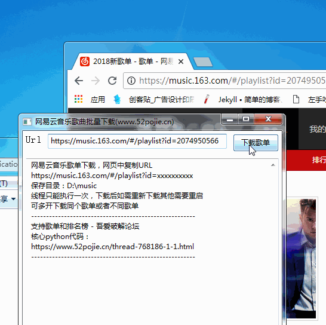

# 网易云音乐歌曲批量下载,免VIP【支持歌单,排名榜】,仅供测试用
网易云音乐歌曲批量下载目前支持歌单和排名榜，只要使用正确的URL则可以使用。

## 更新：
* 20180807 项目上传

## 要求（py脚本）
* python3+requests+python+BeautifulSoup4+lxml

## 文件结构：
```bash
├── dist
│   └── main.exe
├── GUI
│   └── pro-gui.fbp
├── images
│   ├── example.gif
├── README.md
├── src
│   ├── main.py
```

## 使用方法
* 可从dist文件中直接下载main.exe使用或者直接main.py
   


## 声明
仅供测试用
